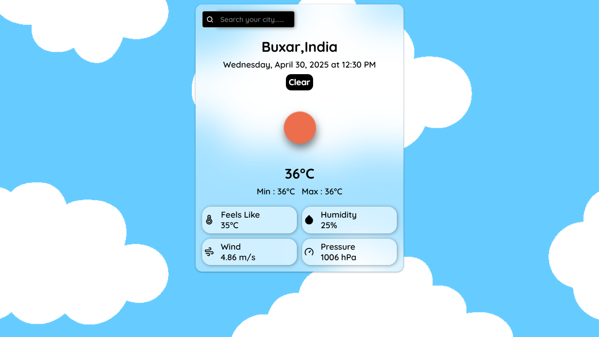

# 🌤️ Weather App


A simple and elegant weather application built using **HTML**, **CSS**, and **JavaScript**, powered by the **OpenWeatherMap API**. Enter any city name to get live weather data including temperature, humidity, wind speed, pressure, and more — all presented in a clean and responsive layout.

---

## 🔍 Preview

> 

---

## 🚀 Features

- 🌍 Live weather data by city name
- 🧭 Country name conversion from ISO code
- 🌡️ Shows:
  - Current temperature
  - Min & Max temperatures
  - Humidity
  - Wind speed
  - Pressure
  - "Feels like" temperature
- 🕒 Formatted date and time display
- 🌈 Weather icons based on current conditions
- 🔍 Search by city with Enter key or button click
- 🎯 Responsive and clean user interface
- 🔁 Loading spinner while fetching data

---

## 🛠️ Technologies Used

- **HTML5**
- **CSS3**
- **JavaScript (ES6+)**
- [OpenWeatherMap API](https://openweathermap.org/api)
- `Intl.DateTimeFormat` & `Intl.DisplayNames` for locale formatting

---

## 📦 How to Use

1. **Clone the repository:**
   ```bash
   git clone https://github.com/C-W-Praduman/Weather-App.git
   cd Weather-App

## 📁 Project Structure
Weather-App/
│
├── Assets/                # SVGs or weather icons
├── index.html             # Main HTML file
├── style.css              # All UI styling
├── script.js              # Weather logic and API handling
└── README.md              # Project documentation

## 👨‍💻 Author

  Made with 💙 by C-W-Praduman